# Trade Control - Wallet Demo

Demonstrates:

1. installing the environment
2. create and configure wallets
3. assign and communicate payment addresses
4. receive and transfer funds
5. pay invoices and account balances
6. miscellaneous payments

We build upon the [Network Demo](https://github.com/tradecontrol/tc-network/blob/master/docs/tc_network_demo.md) to show how supply chains can be financed using bitcoin. However, your customers and suppliers do not need to be connected to the network for you to use the wallet instead of a bank account. Even if they pay into your fiat account, you can easily transfer these funds into the wallet from an exchange.

## Preparation

When installing the supply chain for the Network Demo, select Bitcoin as your Unit of Account with TestNet as the coin type. TestNet replicates Bitcoin's Main network, enabling you to familiarise yourself with the blockchain without spending real money. 

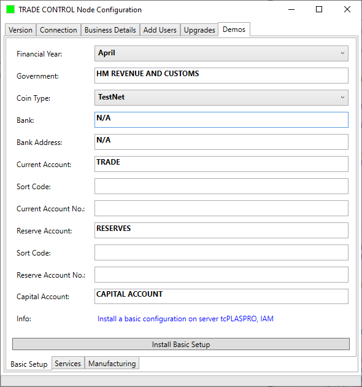

The client Administration page shows the company settings:

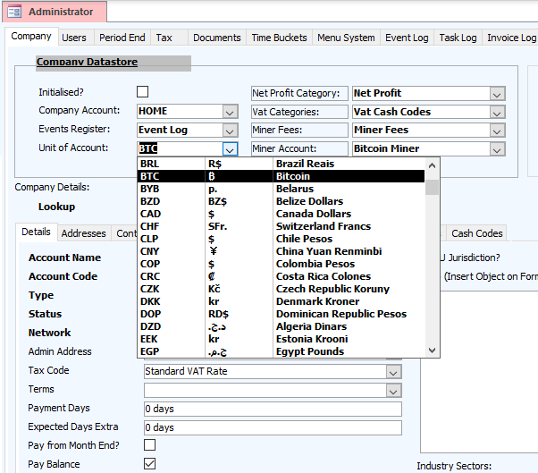

Work through the network demo until you reach [the section on events and transmissions](https://github.com/tradecontrol/tc-network/blob/master/docs/tc_network_demo.md#events-and-transmissions), but don't bother to change the quantities. In so doing, you will have created three companies, connected together in [a supply chain](https://github.com/iamonnox/tradecontrol/blob/master/docs/tc_functions.md#supply-and-demand): Retail -> Secondary Industry -> Primary Industry. Quantity flows up the network (PI -> SI -> RETAIL) whereas value flows down (RETAIL -> SI -> PI). We are going to use the bitcoin blockchain to transact the latter.

Open the Company Statement of the manufacturer (SI) and you will see their transaction-grained balance sheet measured in bitcoin (**mBTC**):

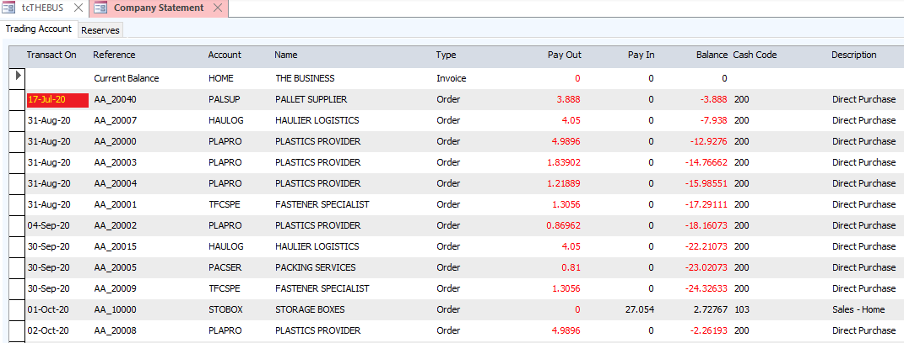

Because they are a start-up company, initially there are no funds to purchase the materials needed to manufacture the product. If you scroll down the statement, you can see how over time the profits are translated into accumulated funds that can finance inputs without credit. This delay in financing is why some customers in trading networks demand a 30-90-day window to pay for services and materials. Our manufacturer requests a 30-day payment term from its suppliers, and COD (Cash on Delivery) from its customer. That way they can purchase the materials to manufacture the goods, despatch and receive payment, then pass the cash down the supply chain so they are up and running. This is what we are going to carry out in the following demo.

## Installation

### Settings

When bitcoin is your UOA, the business is assigned both cash and account codes to automatically monitor blockchain administration costs. Bitcoin administrators are called miners, who receive payment by taking a fee from each financial transaction (plus the new/mined coins they receive for creating another block on the chain). The higher the fee you are prepared to accept, the quicker they will administer your payment. When making a transaction, you can enter any fee you like other than zero, but you are always presented with the latest rate. This is obtained dynamically from the web, and therefore varies from hour to hour. 

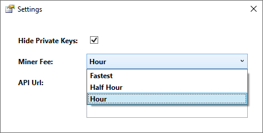
 
Payments are made to keys, which consist of two numbers: a public key, called an address, which you give out like a bank account number to receive payments; and a private key which is required to spend money received by the address. However, you may want to copy the private key, and if so, you can un-hide them.

The wallet uses [NBitcoin](https://github.com/metacoSA/NBitcoin) to interact with the blockchain. The developer also supplies a free API service for testing, which we can use for demonstration purposes. Using bitcoin as a UOA, however, involves setting up your own bitcoin node and API, then specifying the Url in Settings. They explain how to do this simple requirement. 

### Financial Unit

Whilst the Unit of Account is Bitcoin, Trade Control accounts for all financial transactions in milli-bitcoins (**mBTC**). The reason for this is legibility since the exchange rate for 1 BTC is currently around 7,500 GBP, resulting in an unacceptable number of decimal places for trading transactions.

### Connection

Having worked through the network demo, you will be delivering quantity from the Primary Industry through to the Retail Industry. You therefore need three wallets, one for each industry sector, so the money can trickle down the supply chain in exchange for received goods. Because these companies are connected in a consortium, they can communicate payment addresses on the Ethereum blockchain in the same sequence as quantity. So, we will connect to the Plastic Provider first, create a wallet and assign an address to their sales invoice. That address will be sent automatically over Ethereum to the manufacturer and attached to their mirror invoice.

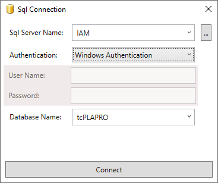

### Wallet

The blockchain ledger of bitcoin is public. Therefore, if you used the same address (bank account number) for all transactions, it would be like your bank account being published online. Wallets are designed to overcome this problem. Trade Control uses a hierarchical deterministic (HD) wallet to issue multiple, seemingly unconnected addresses, whilst simultaneously connecting the payments they receive to commercial workflows.

HD wallets offer significant advantages over business bank accounts, which are basically simple lists of financial transactions (unconnected to workflows).

Here is a few:

- The wallet can be expressed as a hierarchy that models a company's organisational structure
- Budgeted funds can be allocated to departments and individuals that they can spend themselves
- Aggregated balances and transactions can be presented at any point in the hierarchy (i.e. company == traditional bank account)

There are other features not covered here, such as addresses that can be issued by a third party (e.g. website) without the authority to spend the received coins. 

#### Wallet Creation

From a single seed of twelve sequenced words, all the addresses in a hierarchy can be derived. This sequence is called the mnemonic. If you lose the mnemonic, you lose access to the funds in all its addresses. If someone else has access to your mnemonic, all the funds can be stolen. For that reason, mnemonics are often air gapped on sticks or paper.

Associate a wallet with the Plastic Provider's trading cash account:

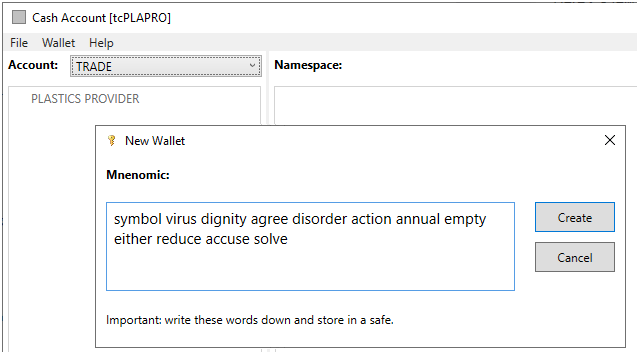

Wallets can be protected by a password, but since this is a commercial wallet and employees leave with their passwords, we are not adding this additional protection. You can save the wallet to a file if you like, which, for the Main blockchain, needs to be secure. 

#### Keys

The wallet is a hierarchy of key names, enabling you to model your organisation's structure or whatever suits your purpose. From the context menu of any selected key, you can create child keys. Here are three ways you can do this, from the most simplistic (the same as your bank account), to modelling the [Foundry Namespace](https://github.com/iamonnox/tradecontrol/blob/master/docs/tc_functions.md#namespaces) expressed in the accompanying paper. 

Bank account:

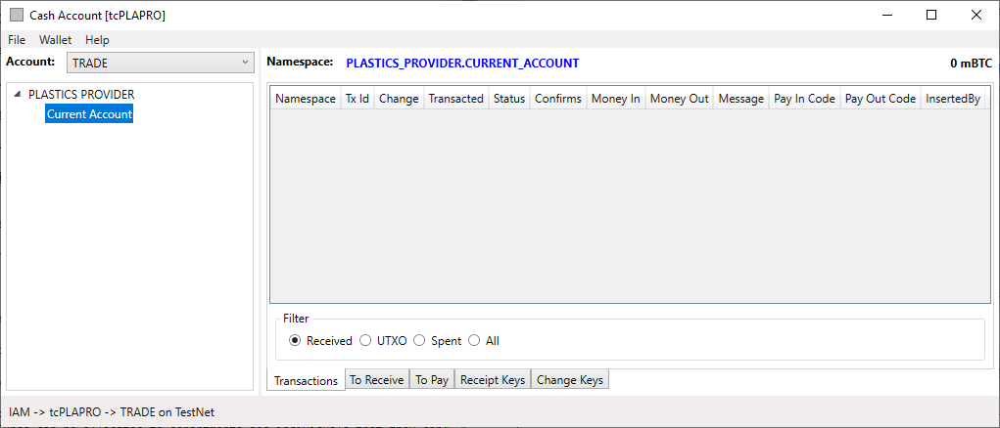

Cash account:

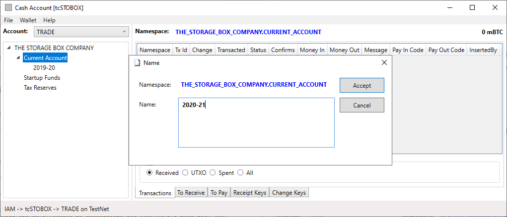

Namespace:

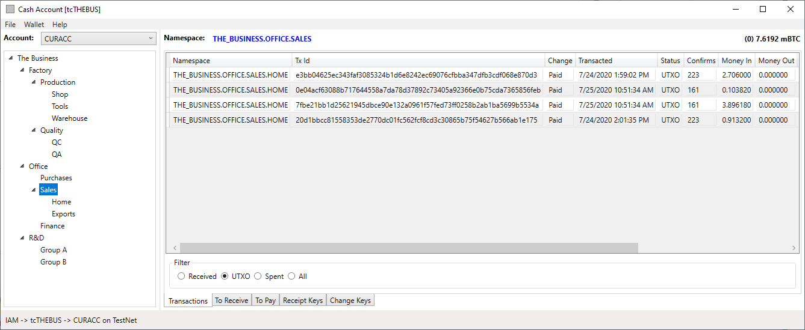

Firstly, each of these keys are hardened, meaning that there is a private key associated with the key name that can spend funds inside its namespace, but nowhere else. For example, you could transfer funds into any key inside TheBusiness.R&D namespace for the department to spend on innovations, but they would not be able to obtain access to funds held within the Office or Factory namespaces. 

Secondly, the Sales key is selected in the wallet that fully expresses a namespace. The balance is 7.6192 mBTC, which is the sum of all the keys inside its namespace. The transactions listed are in the Sales.Home namespace, so there are no coins to spend in the selected key, which is communicated by the (0) balance. This applies to every key. Therefore, if you select the root key (The Business in this wallet), you can see all the transactions inside the entire wallet, and the current balance that can be spent (like a bank account).

## Supply Chain

### Delivery

Let's start delivering stuff.  Return to the [network demo](https://github.com/tradecontrol/tc-network/blob/master/docs/tc_network_demo.md#events-and-transmissions) by logging onto the Plastic Provider and invoicing the first material consignment. From the Providers wallet, create a new payment address for the invoice. This address will be sent over the Ethereum blockchain to the customer.

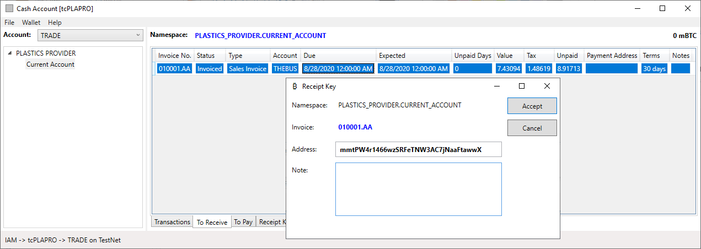

Only the owner of the Invoice Contract on the Ethereum blockchain can assign a payment address, and that owner's EOA must be registered with the customer's consortium and mapped to an account inside the node for it to be recognised. Therefore, the customer can be confident that the payment address is genuine. Log onto the tcTHEBUS account and mirror the Provider's invoice. You will see the payment address in the client, along with the scary prospect of paying tax in bitcoin:

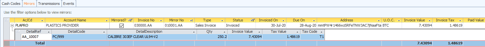

Now the manufacturer has the plastic needed to manufacture the boxes. This process is described in the [BOM Demo](https://github.com/tradecontrol/tc-office/blob/master/docs/tc_demo_manufacturing.md). Here, we are only interested in the financial transaction, so we are going to skip through the production process and forthwith despatch the boxes to the customer. The method is identical to that carried out by the Plastic Provider and is described in the network demo. Once you have despatched and invoiced the boxes, connect to the tcTHEBUS node and open their wallet (from a file or mnemonic). Choose the namespace into which you want payment:

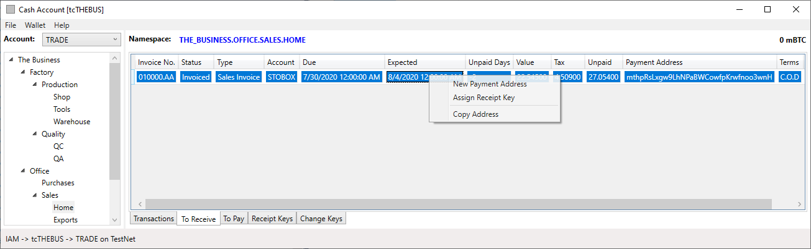

You now have an invoice in the To Pay page and another in the To Receive, but no money.  That must come from the Storage Box Company at the top of the supply chain. Connect to tcSTOBOX and mirror the manufacturer's invoice. 

### Funding

Connecting to the Storage Box Company wallet, we see there is an invoice to pay but no funds to do so. In the section on [Keys](#keys), we created a key name for receiving start-up funding. We need an address for funders so they can pay in enough bitcoin for the company to get going. Select the Startup Fund keys and create a new address:

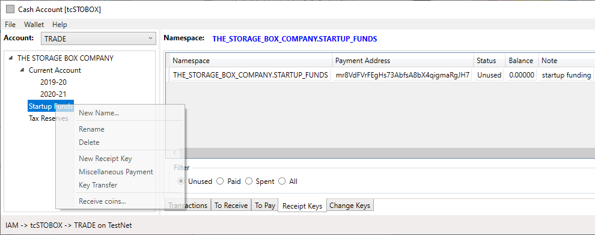

Right click the recept key to copy the address, then either search the web for a TestNet Faucet (you will need about 0.5 BTC) or transfer TestNet bitcoin from another wallet (we've transferred funds from a Trade Control wallet using [Miscellaneous Payments](#miscellaneous-payments)). When payments have occurred, run Receive Coins and the blockchain will be searched in background for new transactions associated with all the unspent keys in the wallet. Opening the properties of the Receipt Key will show the coins at address [mr8VdFVrFEgHs73AbfsA8bX4qigmaRgJH7](https://www.blockchain.com/btc-testnet/address/mr8VdFVrFEgHs73AbfsA8bX4qigmaRgJH7). Unless the TestNet has been re-booted, you can follow these funds through the blockchain as we work through the demo.

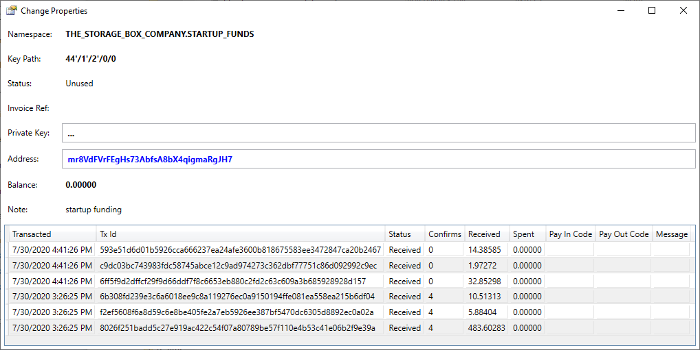 

Although the payment transactions have been received, they are not added to the balance. That is for two reasons:

1. Transactions broadcasted to bitcoin nodes over the P2P network cannot be spent until they are confirmed in the blockchain by miners.
2. The Trade Control wallet does not accept coins that have not been accounted for by the organisation.

In consumer wallets, only the first condition must be met to spend the coins, because the individual knows what the coins are for and where they came from. That is not the case in a commercial setting. The organisation needs to know. Log into the client and create a new organisation responsible for the funds:

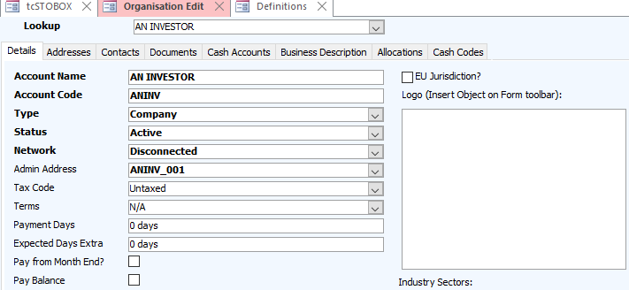

Then enable the Investment Category Code in Definitions, which is disabled by default:

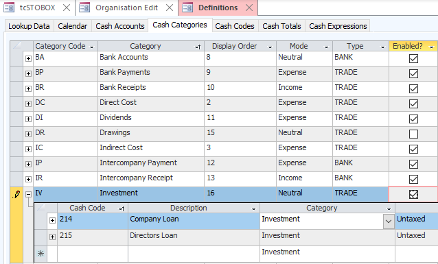

Now all you need to do is pay the coins sent to the address into the Cash Account. As you can see from the Change Properties above, we received several payments, each identified by a unique Transaction Id number (yours will be different). If you look up Tx Id [8026f251badd5c27e919ac422c54f07a80789be57f110e4b53c41e06b2f9e39a](https://www.blockchain.com/btc-testnet/tx/8026f251badd5c27e919ac422c54f07a80789be57f110e4b53c41e06b2f9e39a) in a blockchain explorer, you can see the addresses of all the coins input into the transaction, the address of the coins output and the address for change.  The difference between inputs minus outputs is the administration fee. You can only spend the outputs of a transaction if you have the corresponding private key, which we have. From the transactions/receipts page, use the context menu to pay in your coins:

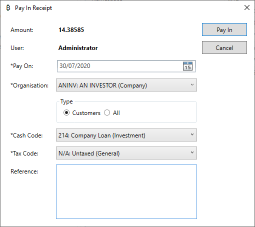

The transactions have been set to UTXO (Unspent Transaction Outputs) and added to the balance:

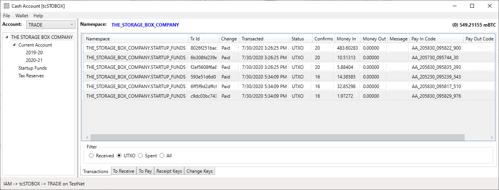

Because this is a commercial wallet, a lot of other actions must take place behind the scenes to connect these transactions to the company's operations. 

1. The Cash Account maps the Tx Id to a payment code, presenting a running balance just like a bank account.

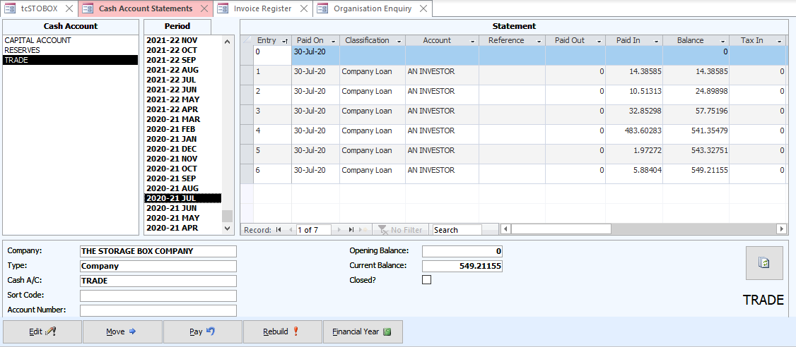

2. Invoices are not just demands to pay and surrogate delivery notes, but also provide a more accurate reflection of the company's position. Therefore, the register is automatically maintained for all payments.

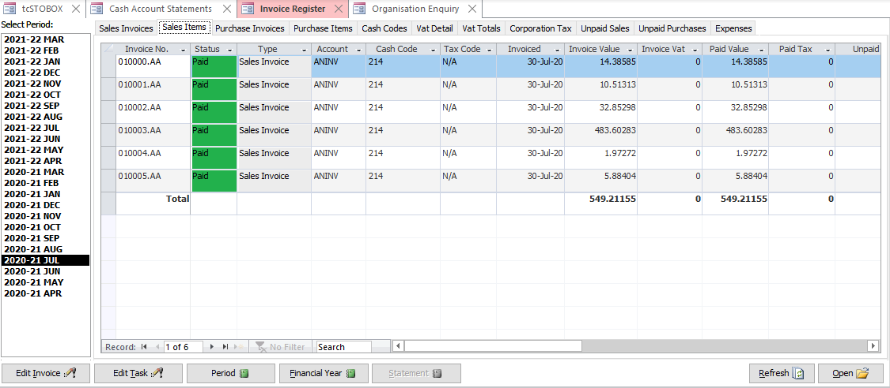

3. Invoices are not paid individually, only the outstanding balance. The payment status of invoices is calculated from the organisation's statement:

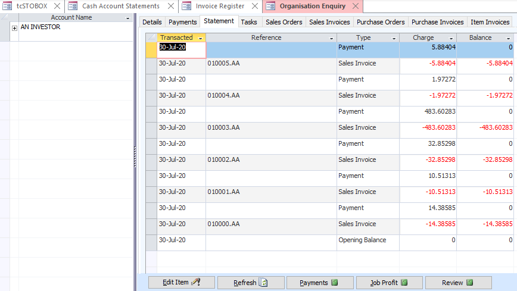

Check out the Company Statement. The forward projected balance is all positive, so the company is in a healthy position and ready to go.

### Coin Transfers

Referring to the Category Codes screenshot above, there are two Categories of type BANK - Intercompany Payment (IP) and Receipt (IR). Cash Codes in these categories are used to move money between bank accounts or wallets. Unlike bank accounts, however, we can also use them to move money around inside the wallet. This is called a Key Transfer.

We now want to transfer the funds into the key that will hold transactions for the current financial year. From the Company Statement, we can see that 200 mBTC will be more than enough to cover expected outgoings (of course, to make the Storage Box Company statement more realistic we would need to add customers and sales). From the context menu of the Startup Funds key, open Key Transfer. We are on the TestNet, so change the default miner fee for the Main network to 2 satoshi's per byte and transfer 200 mBTC. Messages can be attached to the transaction, but it incurs more transaction cost.

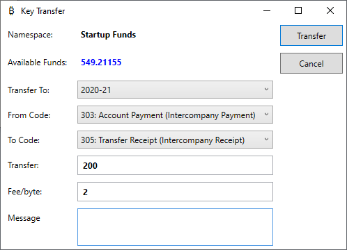

For Bitcoin, because the blockchain does not have any means of relating the output address to the input addresses in the same wallet, this inter-company transfer is identical to a payment. The wallet assigns a new address in the 2020-21 key to receive the coins and another address for change. After constructing one or more transactions to transfer the funds, you are asked to confirm the spend, fee, change and new balance before broadcasting to bitcoin nodes on the P2P network. 

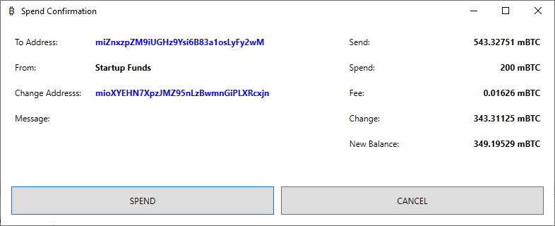

If you select the root of the wallet namespace and view the UTXO, it all looks straight forward.

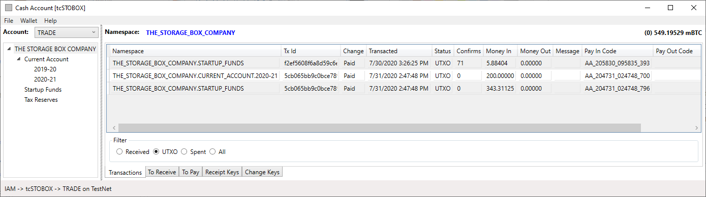

The Invoice Register is also straight forward; it just logs that funds have been moved and an administration fee has been paid out to the blockchain miners. The cost will appear on the P&L against the miner fee Cash Code.

However, if you view the spent transactions, a more complex picture emerges. The transaction that output the 200mBTC, [5cb065bb9c0bce789de70da22a0d14e3e7377d7679ea8ac4742b00c47671b305](https://www.blockchain.com/btc-testnet/tx/5cb065bb9c0bce789de70da22a0d14e3e7377d7679ea8ac4742b00c47671b305) has the outputs of several other transactions as its inputs. This is reflected in the Cash Account Statement because a transaction's inputs and outputs are mapped to account transactions by two respective payment codes so they can be reconciled. In the screenshot below, the Paid In column has the unspent investors transaction, the 200 mBTC transfer and the 343.3 mBTC change. The Cash Account shows the balance at each transaction, like a bank account, whilst the wallet shows the current balance of coins in the keys of the namespace. The current balance of the Cash Account should always equal the balance of the root key of the namespace. Should it differ, for example, because a payment has been retrospectively modified, the Payment Code can be used to locate the discrepancy.

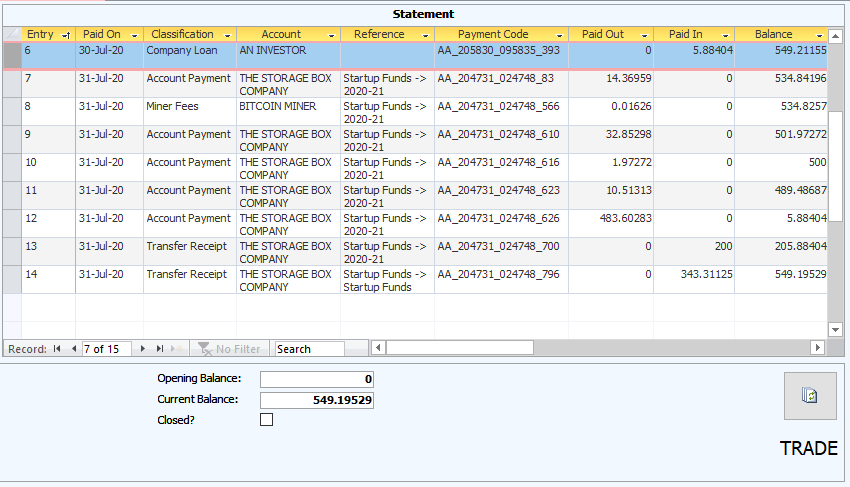

### Payment

We are now able to pay the supply-chain. Because the Trade Control nodes are connected in both polarities (quantity and money), this task is made very easy.  Make sure the Ethereum services are up and running.

#### Retail to Secondary Industry

Select the 2020-21 key with the 200 mBTC funds, and from the context menu, pay the outstanding balance by accepting all the defaults:

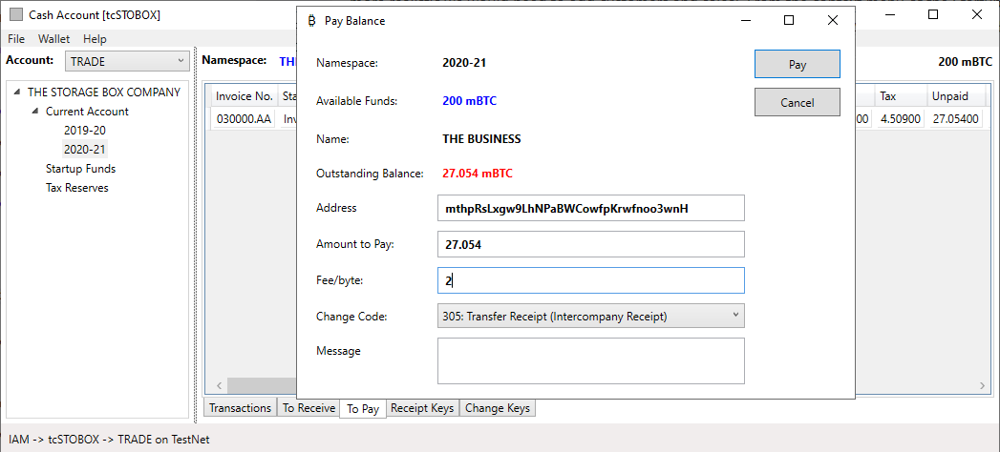 

The Cash Code is only needed to classify transaction change as an intercompany receipt. Confirming the spend will broadcast payment transactions to the blockchain, update the Cash Account, pay off outstanding invoices and send payment confirmation over the Ethereum network by updating the supplier's mirror invoices. The rendition of the Company and Organisation Statements will be correspondingly affected.

Confirm the spend and the coins will be transferred to the supplier ([b56f34564e5aede81f0fc4f1f06cfb30219f3d7a5d9d55108205cb0116d3c52d](https://www.blockchain.com/btc-testnet/tx/b56f34564e5aede81f0fc4f1f06cfb30219f3d7a5d9d55108205cb0116d3c52d)). The supplier's mirror invoice will tell them you have paid for the goods. This transmission is recorded in the Ethereum transaction log.

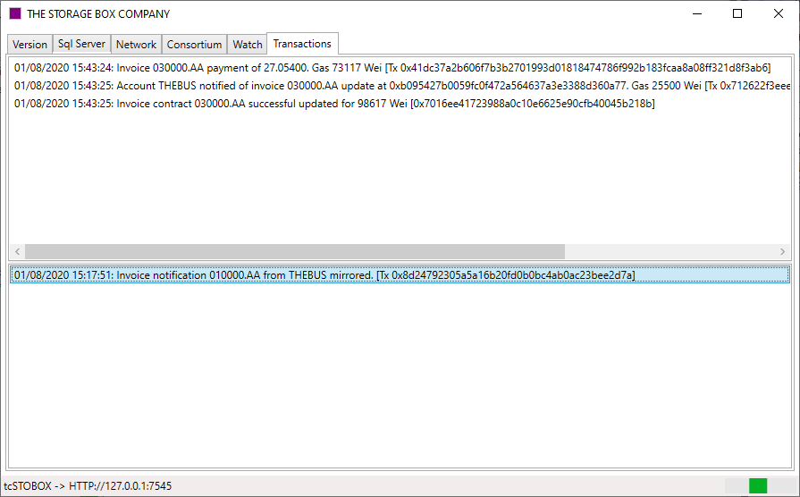

#### Secondary to Primary Industry

Open another instance of the wallet or change the connection. Choose tcTHEBUS and load the wallet associated with their TRADE account (using a saved file or mnemonic). View the properties of the receipt key; the address should match the stored value. If not, you have loaded the wrong wallet. Receive coins from the menu. The *To Receive* invoice will disappear and the paid coins added to the new balance of 27.054 mBTC. You will have to wait a few minutes until a miner confirms that your transaction is genuine.

In the meantime, connect to the tcTHEBUS client and you will see that their invoice has been automatically set to paid and the money deposited into their trading account. The Company Statement is a record of your production and payment priorities. It projects the forward balance, for invoices, orders and tax. Therefore, the positive balance against the Plastic supplier's invoice indicates that we can now pay it. 

Once the transaction is confirmed on the blockchain (confirms > 0), select the The_Business.Office.Sales.Home key where the coins are stored and from the To Pay page, replicate the payment procedure you previously applied when paying for the boxes. 

#### Repeat Ordering

We can repeat the process by manufacturing and shipping another box. All we do is invoice up the supply chain and pay down it. Then check out the P&L, Cash and Company Statements, Status Graphs and so on to see how information inside the node is being transformed by its inputs and outputs. The Company Statement for the manufacturer should look like this:

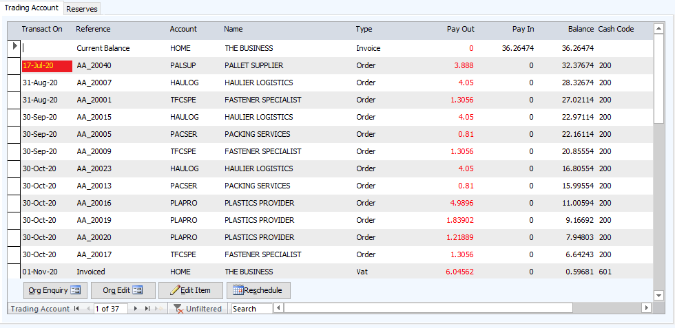

Note that the infrastructure, bodies and activities that one would normally associate with this highly orchestrated process have vanished. 

## Production

One final thing. The supply chain is based on consumption, meaning that materials and services are consumed in the act of production. However, there is also a [Production Network](https://github.com/iamonnox/tradecontrol/blob/master/docs/tc_functions.md#production-networks), where the means of production are not consumed, like tools, buildings and labour. A tool has its own supply chain, but it is not a part of the supply chain it serves. The supply chains intersect. In the previous section, we were processing a supply chain, where the Retail -> Secondary -> Primary industries are connected. But the Mould Tools of the manufacturer are not a part of that, because they are not consumed or transformed, they just wear out. That means the Mould Tool connection to the manufacturer is only one level deep. Wages, for example, are also a part of the Production Network, and that connection will be one level deep as well.

There is no reason why a Production Network cannot join a consortium at the intersection point. However, as long as there is an organisation and address to pay, a cash code to classify the payment, you can use the Miscellaneous Payment option, like a consumer-based wallet, and invoices will be automatically created behind the scenes. 

## Licence

Trade Control Documentation by Trade Control Ltd is licenced under a [Creative Commons Attribution-ShareAlike 4.0 International License](http://creativecommons.org/licenses/by-sa/4.0/) 

